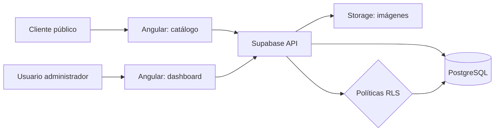
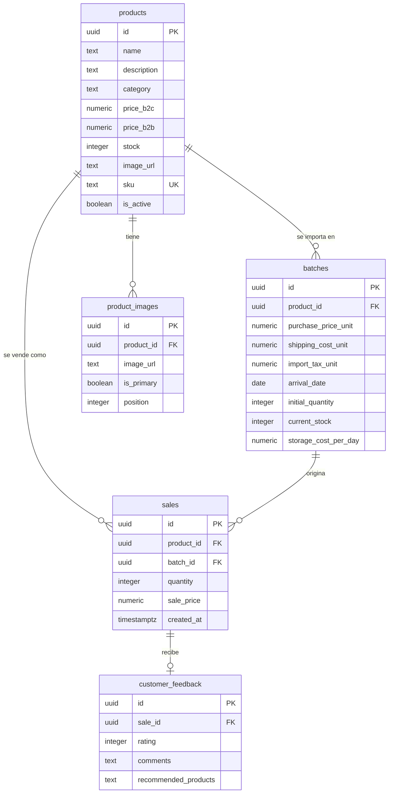

# Importadora Analytics Platform

> Catálogo B2B/B2C y plataforma de inteligencia operativa para una empresa importadora de tecnología y electrónica.

[](https://angular.dev/)
[](https://www.typescriptlang.org/)
[](https://supabase.com/)
[](https://www.chartjs.org/)

## Resumen ejecutivo

Aplicación web desarrollada para digitalizar el catálogo comercial y convertir la operación de importaciones en información accionable. El frontend público permite explorar productos, precios e imágenes y contactar por WhatsApp; el dashboard administrativo concentra alertas de margen, antigüedad y disponibilidad.

El proyecto conecta la experiencia de venta con el control del costo real de inventario: cada producto puede trazarse hasta sus lotes de importación, costos logísticos, impuestos, almacenamiento y ventas. Supabase aporta PostgreSQL, Storage y políticas Row Level Security (RLS) como backend gestionado.

## Funcionalidades clave

| Área | Implementación | Valor para el negocio |
| --- | --- | --- |
| Catálogo comercial | Productos activos, categorías, detalle, imágenes y contacto por WhatsApp | Reduce fricción en la consulta B2C y B2B |
| Precios segmentados | `price_b2c` y `price_b2b` | Permite operar con reglas comerciales diferenciadas |
| Trazabilidad por lotes | Relación entre producto, lote, costo unitario, stock y venta | Conecta cada venta con su origen y rentabilidad |
| Costos de importación | Compra, transporte, impuestos y almacenamiento diario | Calcula el landed cost y detecta inventario envejecido |
| Feedback comercial | Rating, comentarios y productos recomendados | Convierte la posventa en señal para futuras decisiones |
| Seguridad | RLS para lectura pública limitada y operaciones administrativas protegidas | Mantiene una superficie de acceso mínima en la base de datos |
| Operación | Dashboard con alertas de margen bajo, stock bajo, stock antiguo y baja rotación | Prioriza acciones de compra, liquidación y reposición |

## Arquitectura



### Modelo de datos



## Business Intelligence & KPIs

El dashboard está pensado para pasar de datos operativos a decisiones concretas:

| KPI | Fórmula conceptual | Decisión habilitada |
| --- | --- | --- |
| **Landed Cost unitario** | `purchase_price_unit + shipping_cost_unit + import_tax_unit + storage_cost_accrued` | Conocer el costo real antes de fijar precio |
| **Margen neto por lote** | `(revenue - total_landed_cost) / revenue * 100` | Identificar lotes rentables y productos con margen bajo |
| **Rotación de stock** | `units_sold / average_stock` en un período | Detectar baja demanda y exceso de inventario |
| **Antigüedad de stock** | `today - arrival_date` | Activar liquidación cuando el inventario supera 90 días |

La implementación actual calcula el costo acumulado de almacenamiento desde la llegada del lote y expone alertas operativas como margen bajo, stock menor a 10 unidades, inventario mayor a 90 días y baja rotación reciente.

## Stack técnico

- **Frontend:** Angular 21, TypeScript 5.9, standalone components, Angular Router y carga lazy del área administrativa.
- **Datos y backend:** Supabase JS, PostgreSQL, Row Level Security y Supabase Storage.
- **Visualización:** Chart.js y `ng2-charts` para métricas y gráficos del dashboard.
- **Calidad:** TypeScript strict, templates estrictos y pruebas unitarias con Vitest mediante Angular CLI.
- **Despliegue:** configuración preparada para build de producción y Netlify (`netlify.toml` y `_redirects`).

## Instalación rápida

### Requisitos

- Node.js compatible con Angular 21.
- npm 11 o superior.
- Proyecto Supabase con las tablas, relaciones, Storage y políticas RLS descritas arriba.

### Ejecutar localmente

```bash
git clone <URL_DEL_REPOSITORIO>
cd Importadora
npm install
npm start
```

La aplicación queda disponible en `http://localhost:4200/`.

### Configuración de Supabase

La versión actual lee la configuración desde `src/environments/environment.ts` porque Angular CLI no carga archivos `.env` de forma automática:

```ts
export const environment = {
  production: false,
  supabaseUrl: 'https://PROYECTO.supabase.co',
  supabaseAnonKey: '',
  whatsappNumber: ''
};
```

Para un despliegue profesional, estas mismas variables deben gestionarse como secretos o variables de entorno del proveedor


```bash
npm start       # servidor de desarrollo
npm run build   # build y preparación de archivos para despliegue
npm run test    # pruebas unitarias
```

## Buenas prácticas demostradas

- Separación por capas: páginas, layout, servicios, modelos y módulos funcionales.
- Componentes standalone y rutas lazy para reducir el acoplamiento y el coste inicial.
- Tipado estricto en TypeScript y modelos explícitos para el dominio de productos.
- Regla de negocio de landed cost encapsulada en el servicio de productos.
- Seguridad delegada a RLS en la base de datos, en lugar de confiar solo en restricciones visuales del frontend.
- Estados de carga, manejo de errores y fallback para imágenes del catálogo.
- Presupuestos de tamaño configurados para el build de producción.

## Futuras Mejoras 


1. **Cerrar autenticación administrativa:** reemplazar el `adminGuard` provisional por Supabase Auth y una comprobación de rol basada en claims o una tabla `profiles`. Replicar esa regla en políticas RLS.
2. **Mover KPIs a SQL:** crear una vista `inventory_kpis` o funciones RPC para landed cost, margen por lote y rotación. Así los resultados serían consistentes, filtrables por fechas y calculados cerca de los datos.
3. **Reforzar integridad y tipos:** añadir `CHECK` constraints para precios, stock y rating; índices para `product_id`, `batch_id` y `created_at`; y generar tipos TypeScript desde el esquema de Supabase para eliminar contratos implícitos.

## Próximo

- Incorporar migraciones SQL versionadas y un seed reproducible.
- Añadir pruebas de integración para RLS y pruebas end-to-end del flujo catálogo → contacto.
- Incorporar filtros temporales, exportación CSV y auditoría de cambios en inventario.

## Autor

Proyecto personal/académico orientado a demostrar arquitectura frontend, modelado relacional, seguridad de datos y pensamiento de producto aplicado a una operación de importaciones.
